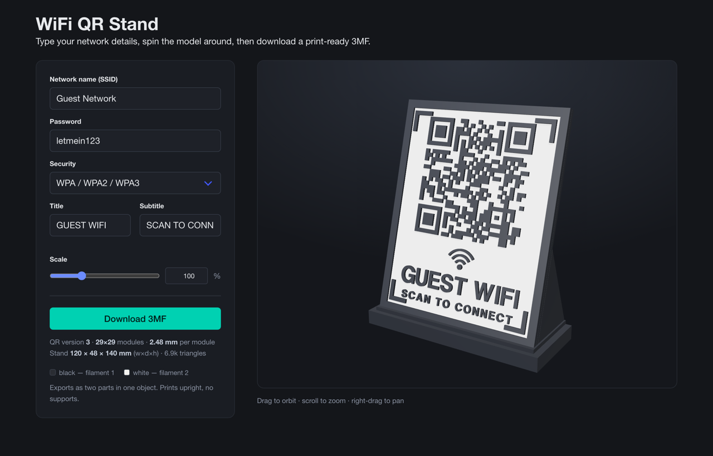

# WiFi QR Stand

Enter your WiFi name and password, get a 3D-printable desk stand with a scannable QR code on it.

**[niek.github.io/wifi-stand](https://niek.github.io/wifi-stand/)**

- Live 3D preview — drag to orbit, scroll to zoom
- Downloads a print-ready **.3mf**: two parts, black and white, on separate filaments
- 120 × 48 × 140 mm by default, scalable 10–500%; prints upright, no supports
- Nothing is sent anywhere — the QR is generated in your browser

One HTML file, no build step. The QR encoder and the 3MF exporter are written from
scratch; only [three.js](https://threejs.org) and [Bulma](https://bulma.io) load from a CDN.
